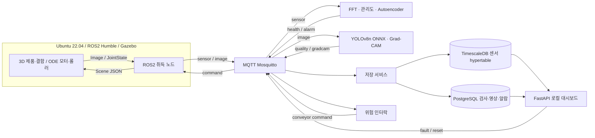
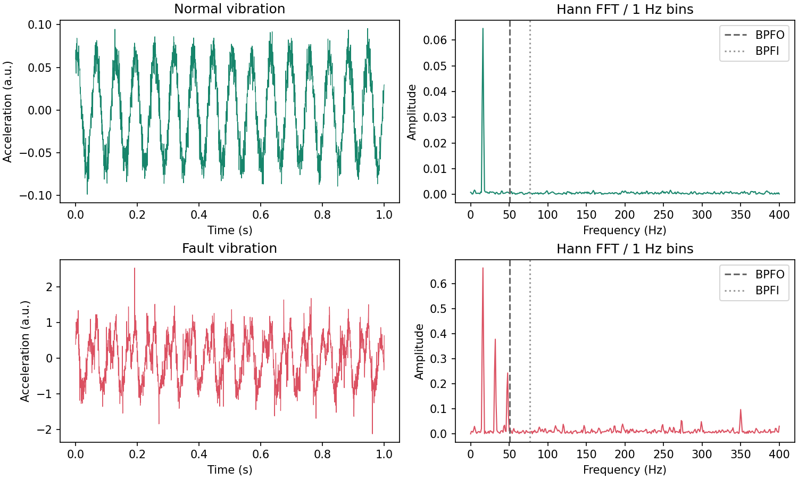

# Smart Factory AI

Gazebo의 3D 검사 영상과 모터 관측값을 이용해 **설비 상태 → 제품 불량 →
관제·라인 정지**를 연결하는 1인 프로젝트다. 모든 서비스는 CPU에서 실행하며,
모듈 간 결과와 제어 명령은 MQTT로 주고받는다.

Gazebo 데이터 생성, 실제 파인튜닝과 독립 테스트를 수행했다. 관리도 F1은
0.9950, AE F1은 0.9885, YOLO 테스트 mAP@0.5는 0.9691다.
CPU ONNX는 전처리와 NMS를 포함한 테스트 100장 평균 66.26 FPS다.
실측 원본과 하드웨어는 `docs/results/`, 체크포인트 해시는 `artifacts/model-card.json`에 있다.

## 시스템 구조



TimescaleDB는 PostgreSQL 확장이므로 한 DB 서버에서 센서는 hypertable에,
품질은 일반 관계형 테이블에 저장한다. 논리 스키마와 저장 방식은 구분된다.

## 실행

개발 폴더는 WSL Ubuntu의 `~/smart-factory-ai`다. VS Code에서 WSL 폴더를
열고 터미널을 사용한다. 호스트는 Ubuntu 24.04지만 **실행 컨테이너는 과제
기준 Ubuntu 22.04 / Python 3.10**이며 호스트 Python은 사용하지 않는다.

```bash
cd ~/smart-factory-ai
code .
docker compose up --build
```

브라우저에서 **http://localhost:8080**에 접속한다. 학습된 `pdm.pt`와
`vision.pt`가 포함되어 있어 추가 학습 없이 실행한다. ONNX 그래프는 최초
실행에 CPU에서 export하며 이때 처음 검사 결과까지 잠시 기다린다.

공개 main의 구현 커밋 `0c949db`을 별도 폴더에 clone하고,
새 브로커·DB 볼륨 및 빈 데이터 폴더에서 한 명령 기동을 검증했다.
ONNX 자동 생성, 8개 서비스, 센서·검사 저장과 실제 JPEG 응답을 확인했다.
기존 Docker 의존성 캐시를 재사용한 조건에서 첫 검사 결과까지 74.408초였다.
네트워크 다운로드부터 시작하는 새 컴퓨터의 빌드 시간은 별도 측정하지 않았다.
원본은 [deployment.json](docs/results/deployment.json)에 있다.

다른 컴퓨터에서 시작할 때:

```bash
git clone https://github.com/hajijiha/smart-factory-ai.git
cd smart-factory-ai
docker compose up --build
```

기본 명령 `docker compose up`도 필요한 이미지를 자동 빌드한다. 최초 빌드에는
Ubuntu/ROS/Gazebo와 CPU PyTorch 의존성을 다운로드할 네트워크가 필요하다.
실행 중 검사는 약 1초 간격으로 발행하며, 20 FPS 기준은 별도 CPU detector
벤치마크다. 전체 DB·렌더링·Grad-CAM을 포함한 생산라인 처리율과 구분한다.

Docker Compose V2의 `docker compose` 명령을 사용한다.
최초 이미지를 빌드·다운로드할 때는 인터넷과 디스크 여유가 필요하다.
Gazebo는 Xvfb/Mesa로 headless CPU 렌더링하므로 NVIDIA GPU가 필요 없다.

```bash
# 백그라운드 실행 / 상태 / 최근 로그
docker compose up -d
docker compose ps
docker compose logs --tail=30 simulator pdm vision

# 종료: 검사 이력과 데이터 볼륨은 유지
docker compose down
```

## 사용 순서

1. 처음에는 Fault Level 0으로 정상 센서 상태와 검사 결과가 나타나는지 확인한다.
2. 고장 슬라이더를 3–6으로 올리고 **레벨 적용**을 누른다. 진동, FFT,
   Health Index, 불량률이 변화하며 경고 단계에서는 알람이 기록된다.
3. 레벨 10을 적용하면 위험 진단 후 인터락이 작동한다. 컨베이어가 정지하고
   화면의 실제 Gazebo 롤러 속도가 0에 가까워지는지 확인한다.
4. 레벨을 0으로 낮추고 HI가 정상으로 돌아온 다음 **안전 재시작**을 누른다.
   위험 상태에서의 재시작 요청은 거절된다.
5. 불량 검사 이력에서 원본 영상과 백본 Grad-CAM을 확인한다. 상관관계는
   충분한 검사 표본과 서로 다른 고장 레벨이 모여야 계산된다.

정지한 컨베이어에서는 제품 검사 이벤트를 발행하지 않는다. 별도 시험대의
진단 모터는 회복 상태를 확인하기 위해 회전한다.

## 데이터 생성·학습 재현

학습용 데이터 원본과 manifest/provenance 전체는 공개 레포에 넣지 않는다.
생성 코드·seed·수량 및 무결성 실측 결과를 제공하며, 재생성하면
`data/`에 영상·레이블·manifest/provenance를 기록한다. 모델 파인튜닝 입력은 외부 데이터셋이 아닌 Gazebo 출력이다.

```bash
# 시뮬레이터 데이터 생성부터 학습·평가·실행까지
bash scripts/reproduce.sh

# 개별 단계: 실행 중인 취득·분석 서비스를 먼저 정지한다.
docker compose stop simulator pdm vision storage controller dashboard
docker compose build
docker compose up -d broker database
docker compose run --rm -e GENERATE_DATA=1 simulator
docker compose run --rm pdm python3 -m factory.pdm.train
docker compose run --rm vision python3 -m factory.vision.train
docker compose run --rm pdm python3 -m pytest tests -q
docker compose up -d
python3 scripts/verify_runtime.py
```

센서는 정상 5,000 + 고장 2,000개, 영상은 정상 3,000 + 결함별 1,000장,
총 6,000장을 실제 생성했다. 생성 시나리오별 70/15/15 분리이며 테스트
장면은 별도 seed·카메라/조명/노이즈 조건을 사용한다.
재현 실험은 CPU 렌더링·학습으로 인해 시간이 걸린다. 이미 완료한 데이터는
완료 marker로 재사용한다. 학습 전 `data/vision/COMPLETE`를 확인한다.

## 코드 구성

```text
simulator/          Gazebo SDF 장면, C++ WorldPlugin, ROS2 취득, 센서 고장 합성
factory/pdm/        FFT 특징, 관리도, AE 모델·학습·MQTT 추론
factory/vision/     YOLO 파인튜닝, ONNX 검출, 실제 역전파 Grad-CAM
factory/storage.py  이벤트 ID 기반 DB 저장과 도착 순서 조정
factory/controller.py  위험 래치·안전 재시작
factory/dashboard.py   읽기 API와 MQTT 조작 명령
factory/analytics.py   5초 구간 Pearson/Spearman·시차 분석
factory/static/     외부 CDN 없이 실행되는 관제 UI
docker/             CPU 실행 이미지, DB 초기 스키마, 브로커 설정
artifacts/          학습 체크포인트와 모델 정보
docs/               모듈 설명·통신 스키마·평가 보고서
scripts/            재현 실행·실제 인터락 통합 검증
tests/              물리 주파수·FFT·통계 처리 검증
```

경로·센서·학습·추론 설정은 `config.yaml`, 접속 설정은 환경변수와
`.env.example`에 분리한다. 코드의 함수·클래스에는 역할을 docstring으로
설명한다. DB 비밀번호는 로컬 데모용 기본값이며 외부 접속 포트는 노출하지 않는다.

## 문서와 평가

- [개발 계획](docs/plan.md)
- [시뮬레이터·데이터 생성](docs/simulator.md)
- [토픽·메시지·시간 동기화](docs/communication.md)
- [예지보전 이론·학습·평가](docs/predictive-maintenance.md)
- [YOLO·Grad-CAM·CPU 평가](docs/vision.md)
- [통합 관제·DB·상관·인터락](docs/integration.md)
- [요구사항 검증표](docs/requirements.md)
- [독립 검증·회귀·발견 결함](docs/validation.md)

필수 평가 기준은 PdM F1 ≥ 0.80 / CPU ≤100 ms, Vision mAP50 ≥ 0.80 /
전처리 포함 100장 평균 ≥20 FPS다. 실제 실행 전에는 이를 달성했다고 표시하지 않는다.
ONNX 경량 배포와 PyTorch 대비 실측 비교를 선택 과제로 구현했다.
RUL LSTM은 구현 대상에 포함하지 않으며 PHM의 수명 예측 단계와 한계를 설명한다.

## 1인 역할과 작업 요약

| 담당 | 수행 범위 |
|---|---|
| hajijiha | 요구사항 분석·일정, 3D 시뮬레이터·합성 데이터, MQTT·DB, PdM·Vision, 관제 UI·안전 제어, 실험·테스트·문서·배포 |

버전 관리는 `feat:`, `fix:`, `docs:`, `test:`, `chore:` 형식의 Conventional
Commits를 사용한다. 실험 결과는 seed·데이터 수량·분리 방식·하드웨어·실측
원본을 함께 남긴다. 이 프로젝트의 합성 환경 결과를 실제 공장 성능으로 일반화하지 않는다.

라이선스는 AGPL-3.0이며 Ultralytics 의존성의 AGPL 조건을 따른다.
모델 구조·학습 방식 참고: [Ultralytics YOLOv8](https://docs.ultralytics.com/models/yolov8/).

## 실측 성능

| 측정 | 결과 | 조건 |
|---|---:|---|
| 통계 관리도 F1 | 0.9950 | 독립 센서 test 1,050개 |
| 정상 학습 AE F1 | 0.9885 | 정상 train 3,500개만 fit |
| PdM 평균 | 0.941 ms | FFT·9특징·두 모델·HI, 100창 × 5회 |
| YOLO test mAP50 | 0.9691 | 독립 영상 test 900장 |
| YOLO test mAP50–95 | 0.9116 | validation 선택 후 test 평가 |
| ONNX 평균 | 66.26 FPS / 15.092 ms | 전처리·NMS 포함, CPU, 100장 |
| PyTorch 평균 | 25.45 FPS / 39.300 ms | 같은 100장·같은 conf/IoU |

하드웨어: Intel(R) Core(TM) Ultra 5 225H, 14 logical CPU,
컨테이너 가시 메모리 7.45 GiB.
Ubuntu 22.04 / Python 3.10.12 / PyTorch 2.5.1+cpu / GPU 사용 없음.
Grad-CAM·JPEG 디코딩·네트워크·DB 저장 시간은 detector FPS에 포함하지 않았다.





## 검증 재실행

검증 전담의 독립 회귀 27개와 실측 ISO 날짜 회귀 1개를 포함한
최종 전체 검사 **28개가 통과**했다. JUnit 원본은 `docs/results/tests.xml`이다.

```bash
# 생성 데이터 없이 실행하면 데이터 의존 검사 2개만 skip된다.
docker compose run --rm --no-deps pdm python3 -m pytest tests -q
# 전체 서비스 실행 후 실제 위험 정지와 복구 / DB 이미지 검증
python3 scripts/verify_runtime.py
python3 scripts/verify_storage.py
# 정상·중간 고장 레벨 반복 실험; 끝나면 레벨 0으로 복구한다.
python3 -m scripts.measure_correlation --hold-seconds 30 --repeats 3
docker compose run --rm --no-deps pdm python3 scripts/analyze_correlation.py
```

`verify_runtime`은 시연을 위해 실제 레벨 10을 적용하고 정상으로 복구한다.
데이터를 다시 학습하려면 `scripts/reproduce.sh`를 사용한다. 중복 Gazebo
토픽을 방지하기 위해 현재 실행 중인 분석·시뮬레이터 서비스를 잠시 정지하며,
저장된 데이터나 DB 볼륨을 삭제하지 않는다.
