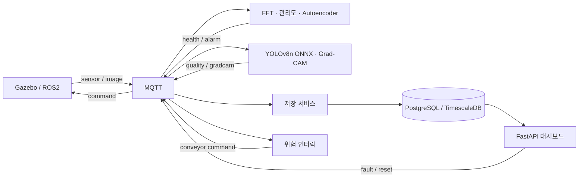

# Smart Factory AI

Gazebo의 모터 센서와 3D 검사 영상을 분석하는 스마트 팩토리 시뮬레이션이다. 설비 진단, 제품 불량 검출, 검사 이력과 컨베이어 정지를 MQTT로 연결한다. 모든 서비스는 CPU에서 실행한다.

관제 화면에서 설비 상태, 센서 추세, 롤러 속도, 검출 결과와 검사 이력을 확인할 수 있다. 제어 명령의 접수·적용 상태와 오래된 데이터도 구분해서 표시한다.


## 실행

Docker와 Docker Compose V2가 필요하다. Windows에서는 Docker Desktop의 WSL 통합을 사용한다. 컨테이너 환경은 Ubuntu 22.04 / Python 3.10이며, Gazebo는 Xvfb/Mesa로 CPU 렌더링한다.

```bash
git clone https://github.com/hajijiha/smart-factory-ai.git
cd smart-factory-ai
docker compose up --build
```

대시보드는 **http://localhost:8080**에서 열린다. 학습된 `pdm.pt`, `vision.pt`를 포함하며, ONNX 그래프는 최초 실행 시 자동으로 생성한다. 처음 빌드할 때 의존성 다운로드를 위한 인터넷 연결과 초기화 시간이 필요하다.

```bash
docker compose up -d
docker compose ps
docker compose logs --tail=30 simulator pdm vision
docker compose down
```

`docker compose down`으로 종료해도 검사 이력과 데이터 볼륨은 유지된다. 설정은 `config.yaml`, 접속 정보는 `.env.example`에서 확인한다. DB의 기본 비밀번호는 로컬 데모용이며 외부 접속 포트는 노출하지 않는다.

## 사용

1. Fault Level 0에서 정상 센서 상태와 검사 결과를 확인한다.
2. 고장 레벨을 3–6으로 올리고 **레벨 적용**을 누른다. 진동, FFT, Health Index와 불량률이 바뀌며 경고 시 알람이 기록된다.
3. 레벨 10에서는 위험 인터락이 컨베이어를 정지시킨다. Gazebo 롤러 속도가 0에 가까워지는지 확인한다.
4. 레벨을 0으로 낮추고 HI가 정상으로 돌아오면 **안전 재시작**을 누른다. 위험 상태에서는 재시작 요청이 거절된다.
5. 검사 이력에서 원본 영상과 Grad-CAM을 확인한다. 상관관계 계산에는 서로 다른 고장 레벨의 검사 표본이 필요하다.

컨베이어 정지 중에는 제품 검사를 발행하지 않는다. 별도 시험대의 진단 모터는 회복 상태 확인을 위해 계속 회전한다.

## 시스템 구성



한 PostgreSQL 서버에서 센서는 TimescaleDB hypertable에, 검사·영상·알람은 관계형 테이블에 저장한다.

| 경로 | 역할 |
|---|---|
| `simulator/` | Gazebo 장면, C++ 플러그인, ROS2 취득과 센서 합성 |
| `factory/pdm/` | FFT 특징, 관리도, Autoencoder 학습·추론 |
| `factory/vision/` | YOLO 학습, ONNX 검출, Grad-CAM |
| `factory/storage.py` | 이벤트 저장과 도착 순서 처리 |
| `factory/controller.py` | 위험 정지와 안전 재시작 |
| `factory/dashboard.py`, `factory/process.py`, `factory/static/` | 관제 API와 화면 |
| `factory/analytics.py` | Pearson/Spearman 상관과 시차 분석 |
| `docker/`, `artifacts/`, `scripts/`, `tests/` | 실행 환경, 모델, 재현·검증 도구 |

## 실험 결과와 한계

기존 생성 규칙(v1)의 합성 데이터에서 측정한 결과다.

| 측정 | 결과 | 조건 |
|---|---:|---|
| 통계 관리도 F1 | 0.9950 | 합성 센서 test 1,050개 |
| 정상 학습 AE F1 | 0.9885 | 정상 train 3,500개만 학습 |
| PdM 평균 | 0.941 ms | FFT·9특징·두 모델·HI, 100창 × 5회 |
| YOLO test mAP50 | 0.9691 | 합성 영상 test 900장 |
| YOLO test mAP50–95 | 0.9116 | validation 선택 후 test 평가 |
| ONNX 평균 | 66.26 FPS / 15.092 ms | 전처리·NMS 포함, CPU, 100장 |
| PyTorch 평균 | 25.45 FPS / 39.300 ms | 같은 100장·같은 conf/IoU |

측정 환경은 Intel Core Ultra 5 225H, 14 logical CPU, 컨테이너 메모리 7.45 GiB, Ubuntu 22.04 / Python 3.10.12 / PyTorch 2.5.1+cpu다. GPU는 사용하지 않았다.

Detector FPS에는 Grad-CAM, JPEG 디코딩, 네트워크와 DB 저장 시간이 포함되지 않는다. 실행 중 검사 결과는 약 1초 간격으로 발행한다.

합성 데이터의 높은 점수가 실제 공장 성능을 보장하지는 않는다. 운전 조건, 약한 고장과 결함 형태를 확장한 v2 검증에서는 기존·후보 모델 모두 조건별 판정이 WARN이며, 실제 공장과 저대비 결함은 UNVALIDATED다. 기본 실행 모델과 후보 실험 모델은 별도로 관리한다.

[합성 데이터 편향 검증](docs/bias-validation.md)에 조건별 실패와 원시 결과, [모델 카드](artifacts/model-card.json)에 체크포인트 정보를 기록했다.

## 데이터 생성과 재학습

학습용 센서·영상 원본은 Git에 포함되지 않는다. 아래 명령으로 Gazebo 데이터 생성부터 학습·평가·실행까지 재현한다.

```bash
bash scripts/reproduce.sh
```

기존 데이터는 센서 정상 5,000개·고장 2,000개, 영상 정상 3,000장·결함별 1,000장으로 총 6,000장이다. 생성 시나리오별로 70/15/15 분할하며 테스트는 별도 seed와 카메라·조명·노이즈 조건을 사용한다.

재현 스크립트는 중복 Gazebo 토픽을 방지하기 위해 실행 중인 취득·분석 서비스를 잠시 정지한다. 완료 marker가 있는 데이터는 재사용하며, 저장 데이터나 DB 볼륨을 삭제하지 않는다. CPU 렌더링과 학습에는 시간이 걸린다.

개별 실행 순서와 데이터 기록 방식은 [시뮬레이터 문서](docs/simulator.md)에 있다.

## 검증

```bash
docker compose run --rm --no-deps pdm python3 -m pytest tests -q
python3 scripts/verify_runtime.py
python3 scripts/verify_storage.py
python3 -m scripts.measure_correlation --hold-seconds 30 --repeats 3
docker compose run --rm --no-deps pdm python3 scripts/analyze_correlation.py
```

데이터가 없는 환경의 회귀 검사는 133개 통과·2개 skip이었다. 데이터 의존 검사 2개는 원본 v1 데이터를 연결한 별도 실행에서 통과했다. 범위와 JUnit 원본은 [공정 관제 검증](docs/process-control.md#검증)에 있다.

`verify_runtime.py`는 전체 서비스가 실행 중일 때 레벨 10으로 위험 정지를 확인하고 정상으로 복구한다. 상관관계 측정 스크립트도 완료 후 레벨 0으로 복구한다.

## 문서

- [시뮬레이터와 데이터](docs/simulator.md)
- [MQTT 메시지와 시간 동기화](docs/communication.md)
- [예지보전 학습·평가](docs/predictive-maintenance.md)
- [YOLO·Grad-CAM·CPU 평가](docs/vision.md)
- [관제·저장·인터락](docs/integration.md)
- [공정 관제 화면과 제어 조건](docs/process-control.md)
- [구현 범위와 평가 기준](docs/plan.md) · [요구사항 검증표](docs/requirements.md)
- [통합 검증](docs/validation.md) · [기동 검증 원본](docs/results/deployment.json)

라이선스는 [AGPL-3.0](LICENSE)이다. 모델 구조와 학습 방식은 [Ultralytics YOLOv8](https://docs.ultralytics.com/models/yolov8/)을 참고했다.
