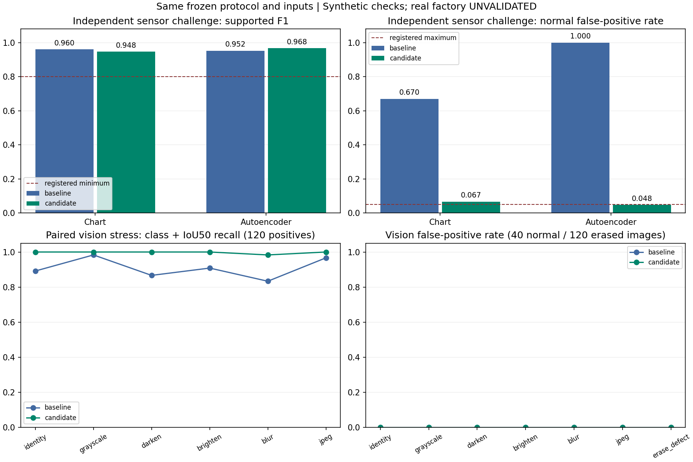

# 합성 데이터 편향과 강건성 검증

이 프로젝트의 데이터는 Gazebo 장면과 가상 진동 모델에서 생성된다. 별도 seed의 테스트 데이터라도 동일한 생성 규칙을 공유하므로, 높은 F1·mAP만으로 실제 설비와 제품에 대한 일반화를 판단할 수 없다. 해시 중복 검사와 클래스 수량 검사는 무결성 검사이며 편향이 없다는 증거가 아니다.

## r3 데이터 검사 결과

센서 7,000개와 영상 1,800장을 새로 취득했다. 센서 100개 조건 그룹과 영상 20개 형상 그룹을 train/val/test로 분리했으며, 그룹 재사용·중복 이미지·손상된 라벨·완료 마커 불일치는 발견하지 않았다. 영상 결함 900장 모두의 원본 정상/결함 PNG를 독립 코드로 다시 비교해 등록된 픽셀·레이블 기준을 통과했다. 한 Gazebo 모터와 동일 렌더러에서 만든 합성 조건 그룹이다.

| 검사 | 측정값 | 해석 |
| --- | --- | --- |
| 실제 렌더-레이블 사전 검사 | 9/9 PASS | 세 클래스와 세 크기의 원본 PNG 비교 |
| 결함 전수 원본 검사 | 900/900 PASS | train 630 / val 135 / test 135쌍, 재촬영·표본 제외 없음 |
| 센서 nuisance-only 분류 | 그룹 분리 5-fold AUC 0.5000 | 우연 수준 0.5, 검사한 운전·잡음 메타데이터 |
| 영상 nuisance-only 분류 | 그룹 분리 5-fold balanced accuracy 0.2339 | 우연 수준 0.25, 검사한 배경·재질·카메라 등 17변수 |
| 코드 회귀 검사 | 81 passed | 데이터·모델 provenance, 동기화, 인터락 등 |
| 실제 설비·저대비 결함 | UNVALIDATED | 실제 센서·카메라 데이터 미평가 |

근거: [전체 데이터 감사](results/bias-v2/candidate-data-audit.json), [사전 검사 이미지](results/bias-v2/render-check/render-check-montage.png), [JUnit 결과](results/bias-v2/tests.xml). 낮은 nuisance 예측력은 검사한 메타데이터에서 shortcut을 관찰하지 못했다는 뜻이며, 이미지의 미검사 단서나 실제 환경의 편향을 배제하지 않는다.

영상 validation의 세 그룹은 모두 어두운 배경 bin에 속한다. 그룹 간 누출은 없지만 검증 분할의 배경 범위가 넓지 않아, checkpoint 선택이 모든 배경 조건을 대표한다고 볼 수 없다. [독립 데이터 검토](results/bias-v2/independent-data-review.json)에 이 범위 제한과 현재 소스·완료 기록 대조를 남겼다.

## 고정 모델 최종 비교

모델 선택을 마친 뒤 기존·후보의 PT/ONNX와 프로토콜 해시를 고정했다. 최종 seed는 **862047**이며, 센서 3,630개 창과 영상 160장에 대한 1,080개 변환 평가를 두 모델에 동일하게 적용했다. 실제 센서 특징 바이트와 변환된 BGR 픽셀·라벨·입력 shape·추론 설정·평가 코드·라이브러리 버전의 일치를 확인했다. 평가 전후 모델 파일의 해시는 같았으며 결과를 보고 재학습하거나 임계값을 조정하지 않았다.

| 동일 입력의 측정값 | 기존 v1 모델 | r3 후보 모델 |
| --- | ---: | ---: |
| 관리도 F1, 지원 신호 2,970창 | 0.9599 | 0.9477 |
| 관리도 정상 오경보, 정상 270창 | 181/270 · 67.04% | 18/270 · 6.67% |
| AE F1, 지원 신호 2,970창 | 0.9524 | 0.9677 |
| AE 정상 오경보, 정상 270창 | 270/270 · 100% | 13/270 · 4.81% |
| 영상 원본 class+IoU50 검출 | 107/120 · 89.17% | 120/120 · 100% |
| 영상 회색조 class+IoU50 검출 | 118/120 · 98.33% | 120/120 · 100% |
| 영상 블러 class+IoU50 검출 | 100/120 · 83.33% | 118/120 · 98.33% |
| 원본 정상 영상 오검출 | 0/40 | 0/40 |
| 결함을 지운 영상 오검출 | 0/120 | 0/120 |
| 등록된 조건별 판정 | WARN | WARN |



지원 신호의 양성 비율은 90.9%다. 모든 창을 고장으로 판정한 기존 AE도 F1 0.9524를 얻으므로, F1만으로 모델의 정상 구분 능력을 판단하면 안 된다. 후보 AE는 평균 오경보를 줄였지만 지원 조건별 경고가 남았다. 15 Hz·잡음 0.05의 정상 30창에서는 관리도 10/30(33.33%), AE 4/30(13.33%)가 오경보였다. 회전수 5/18 Hz·잡음 0.10의 범위 밖 정상 60창은 후보 두 모델 모두 60/60을 이상으로 판단했다. 영상 변환 검사에는 성능 저하 경고가 없었지만 대비가 뚜렷한 단순 합성 proxy의 결과다.

오경보 감소와 함께 민감도도 변했다. 지원 고장 2,700창의 누락은 관리도 41→252개, AE 0→157개였다. 후보의 레벨 1 재현율은 관리도 43.33%, AE 57.78%이며 레벨 3–10은 등록된 80% 기준을 통과했다. 약한 고장에 대한 탐지 개선은 여전히 필요하다.

평균 AE 오경보율 4.81%의 Wilson 95% 구간은 2.84–8.06%다. 5% 이하라는 점 추정만으로 모든 운전 조건의 기준 충족을 선언하지 않는다. 정상 이미지 0/40 오검출도 현장 오경보율 0을 뜻하지 않는다. 원시 개수와 Wilson 구간·조건별 실패는 [기존 최종 평가](results/bias-v2/baseline-challenge.json), [후보 최종 평가](results/bias-v2/candidate-challenge.json), [비교 JSON](results/bias-v2/comparison.json), [독립 최종 검토](results/bias-v2/evaluation-review.json)에 있다.

이 비교는 같은 최종 입력에서의 고정 모델 비교이며, 데이터 개선만의 효과를 분리한 통제 실험은 아니다. 기존 영상은 6,000장·35회 학습 계획에서 선택된 10회차 체크포인트이고 후보는 1,800장·10회 학습 계획이다. 센서 임계값 선택 규칙도 달라졌다. 성능 차이를 데이터 하나의 원인으로 단정하지 않는다.

### 후보의 일반 테스트와 CPU 측정

후보의 미사용 그룹 테스트는 센서 1,050창과 영상 270장이다. 센서 관리도 F1은 0.9583, AE F1은 0.9589였고 영상 mAP@0.5는 0.9950, mAP@0.5:0.95는 0.9093이었다. 같은 생성기의 그룹 holdout이므로 독립 신호 도전이나 실제 설비 검증과 구분한다.

CPU 4 inference threads에서 영상 100장을 측정한 ONNX 평균은 16.694 ms(59.90 FPS), PyTorch는 38.886 ms였다. 전처리·추론·NMS를 포함하고 JPEG 디코딩·네트워크·DB·Grad-CAM은 제외한다. 예지보전의 FFT·특징·두 모델·HI 계산은 100창 × 5회 평균 1.039 ms였다. 실제 측정은 학습·촬영·최종 도전 추론을 종료한 후 수행했다.

근거: [센서 일반 테스트](results/bias-v2/pdm.json), [영상 일반 테스트](results/bias-v2/vision.json), [실험 환경·데이터·소스 식별](results/bias-v2/run-metadata.json). 기본 실행 체크포인트는 유지한다. 후보는 별도 디렉터리의 실험 모델이며 조건별 오경보와 범위 밖 실패가 해결되기 전 자동 교체하지 않는다. 이후 모델 변경에 이 최종 결과를 사용한다면 새 seed·프로토콜로 최종 검증해야 한다.

## 기존 데이터의 검증 범위

- 센서는 정상 레벨 0과 고장 레벨 2–10만 포함한다. 레벨 1과 실제 운전 속도 변화는 검증하지 않았다. 관측 회전수는 약 954.93 RPM으로 고정된다.
- 기존 가상 진동은 고장 강도가 증가하면 백색 잡음도 증가한다. 모델이 고장 주파수보다 잡음이나 전체 진폭에 의존할 수 있다.
- 기존 영상의 흠집·찍힘·오염은 제한된 크기와 색의 기하학적 도형이다. 카메라·조명 변화를 테스트했어도 새로운 결함 형태·재질·실제 촬영 환경을 검증한 것은 아니다.
- 클래스별 영상을 순서대로 취득하면 시간 경과와 렌더링 상태가 클래스와 연관될 수 있다. 파일명·시간·정답 클래스는 추론 입력으로 사용하지 않지만, 취득 과정의 잠재적 혼입 변수는 별도로 검사한다.
- 시뮬레이션의 고장 레벨은 진동과 불량 발생 확률을 동시에 바꾼다. 두 결과의 상관은 설계된 공통 원인의 영향이며 실제 공장에서 진동이 불량을 유발한다는 인과 증거가 아니다.

기존 성능 수치와 모델은 기존 합성 벤치마크 결과로 유지한다. 새 데이터나 새 모델의 결과와 합쳐서 표시하지 않는다.

## 사전 등록과 역할 분리

`scripts/bias-protocol.json`에 검증 범위, seed, 표본 수와 데모용 판단 기준을 기록한다. 데이터 생성 구현과 독립 검증 구현은 별도 모듈이다. 검증용 센서 신호는 `simulator.signal`을 호출하지 않고 다른 식으로 구성하며, 영상 검사도 실제 저장된 입력 바이트와 정답을 읽어 수행한다. 이 분리는 생성 가정에 대한 독립성을 높이지만 실제 데이터의 대체물은 아니다.

학습은 정상 학습 세트에서 정규화와 모델을 fit하고 검증 세트에서 임계값·체크포인트를 선택한다. 최종 테스트 전에 모델과 프로토콜 해시를 고정한다. 최종 결과를 보고 임계값·데이터 분포·모델을 바꾸면 해당 테스트는 개발용으로 강등하고, 새 프로토콜과 새 seed의 최종 검증이 필요하다. 동일한 테스트에 반복적으로 맞춘 뒤 독립 검증으로 부르지 않는다.

## 데이터 검사

`scripts.bias_audit`는 다음 증거를 독립적으로 확인한다.

1. 센서 특징이 유한한 9차원 벡터인지, NPZ와 provenance의 레벨·분할·그룹이 일치하는지 검사한다.
2. 이미지·레이블·manifest·완료 마커의 바이트 해시와 표본 수를 확인한다. v2 마커는 현재 생성 소스·설정·manifest와 일치해야 한다. 마커의 존재만으로 완료를 인정하지 않는다.
3. 기계·운전 세션 그룹이 train/val/test에 재사용되지 않는지 검사한다. 다른 창이나 seed라도 같은 그룹이면 독립 표본으로 취급하지 않는다.
4. 고장 레벨·운전 속도·잡음·운전 조건과 결함 클래스의 표본 수를 공개한다. 카메라·조명·재질 같은 nuisance 변수의 클래스별 분포 차이를 표준화 평균 차이(SMD)와 KS 통계량으로 측정한다.
5. 정답과 고장 특징을 제외한 nuisance 메타데이터만으로 정답을 예측하는 교차 검증 분류기를 만든다. 그룹이 있으면 교차 검증도 그룹 단위로 분리한다. 센서 AUC와 영상 balanced accuracy가 우연 수준을 크게 넘으면 shortcut 후보로 기록한다.

v2 데이터의 fingerprint에는 Gazebo 플러그인 소스와 빌드된 라이브러리의 바인딩도 포함한다. 생성 시에는 빌드 기록·바이너리 해시와 실제 gzserver가 로딩한 파일 경로·inode를 확인해 오래된 C++ 바이너리 사용을 차단한다. 독립 감사는 현재 소스 해시와 기록된 바이너리 해시의 형식·정합을 확인한다. 감사 컨테이너에 라이브러리가 없을 수 있으므로 실제 프로세스의 로딩 상태를 다시 검사했다고 주장하지 않는다.

영상 r1에서는 실제 렌더링이 해석적 레이블보다 크게 그려지는 오류가 시각 검토에서 발견됐다. 원인은 Gazebo Visual의 scale을 단위 메시의 절대 크기로 적용해야 하는데 이전 크기에 대한 비율로 적용한 것이었다. 해당 수집본은 유효 데이터로 승격하지 않았으며 진행 중 학습을 중단하고 자료를 보존했다. 최종 모델 선택·도전 평가 결과를 보고 변경한 것이 아니다.

r2에는 세 결함 클래스 × scale 0.68/0.93/1.18의 9쌍 실제 렌더 검사를 필수화했다. 동일한 카메라·제품 위치·조명·재질·배경에서 정상 PNG와 결함 PNG를 취득하고, 인위적 영상 잡음이나 학습 모델 없이 픽셀 차이의 경계와 해석적 레이블을 비교한다. bbox IoU 0.70 이상·레이블 영역 밖 변화 픽셀 비율 0.10 이하·변화 픽셀 5개 이상을 요구한다. 래스터 반올림은 각 경계가 2픽셀 이내인 경우에만 허용하며 보정 전 raw IoU도 별도로 기록한다.

`render-check.json`과 실제 PNG 쌍의 해시, 9개 조건 행렬, 소스 fingerprint와 모델 미사용 상태를 완료 마커에 연결한다. 독립 감사는 이 기록의 PASS 문구만 읽는 대신 저장된 PNG에서 픽셀 차이·raw/보정 IoU·영역 밖 비율을 다시 계산한다. 기록이나 재계산이 일치하지 않으면 학습에 사용할 수 없는 FAIL이다. 이 게이트는 레이블과 렌더 기하학의 정합을 확인하며 실제 결함의 물리적 사실성이나 실제 공장 성능을 검증한 것은 아니다.

후속 r2 검사에서는 9쌍 중 한 정상 프레임에 직전 결함·제품 위치가 남고 배경만 갱신된 비동기 렌더링 문제도 검출했다. 실패 자료를 보존하고, v2 취득에 ACK 수신 후 벽시계 250 ms·그 이후 새로운 프레임 최소 3개·카메라와 joint 시각이 ACK simulation 시각보다 100 ms 이후라는 취득 조건을 추가했다. 독립 감사는 각 쌍과 전체 영상의 scene/ACK ID, 새 프레임 카운터, 시간 차와 저장된 관측값의 정합을 확인한다. 타이밍 메타데이터만으로 픽셀의 장면 ID가 증명되지는 않으므로 실제 PNG의 렌더-레이블 게이트를 함께 유지한다. 검사 임계값이나 최종 모델 성능 기준을 낮추어 실패를 통과시키지 않는다.

새 프레임 조건만으로 전체 장면의 반영을 보장할 수 없어, 같은 전체 장면을 픽셀 결과와 무관한 고정 일정으로 3회 적용한다. 각 회차에는 고유 명령 ID를 사용하고 직전 ACK와 다음 명령 사이에 최소 100 ms를 둔다. ACK의 범위는 물리 상태 적용과 visual 메시지 enqueue이며 렌더링 완료가 아니다. 마지막 ACK 이후의 취득 조건을 적용하고, 독립 감사는 transaction·회차·명령 ID·간격·마지막 ACK 연결을 확인한다. 이 정책은 비동기 전송 문제를 줄이는 조치이며 원본 픽셀 검사를 대체하지 않는다.

영상 1,800장 구성에서는 결함 900장 모두에 대해 동일 조건의 정상 counterpart를 한 번씩 고정 취득한다. 원본 PNG 900쌍은 학습 이미지 디렉터리 밖 `vision/render-pairs/`에 보관하고, 학습 표본 수는 정상 900장·결함 900장으로 유지한다. 한 쌍이라도 렌더-레이블 기준에 실패하면 재촬영하거나 유리한 프레임을 선택하지 않고 취득을 중단하며 실패 자료를 보존한다. 독립 감사는 전체 900쌍의 바이트 해시와 픽셀 지표를 재계산하고, 결함 장면·capture 기록·학습 레이블·manifest fingerprint·완료 마커의 개수를 연결한다. 정상 학습 행에는 render pair가 없고 결함 행에는 각각 고유 pair가 있어야 한다. 원시 변화 픽셀 수, raw/보정 IoU, 영역 밖 비율과 split·클래스별 검사 수를 감사 JSON에 기록한다. 이 추가 검사는 최종 모델 결과를 보기 전에 발견된 실제 렌더링 오류에 따른 무결성 보강이며 평가 seed나 ML 판단 기준의 변경이 아니다.

실제 r2 전체 취득은 1,015개 행을 기록한 뒤 dent proxy의 저대비 외곽 링에서 중단됐다. `vision-v2-0017-0025`의 변경 픽셀 357개·보정 IoU 0.683379·raw IoU 0.665043·영역 밖 비율 0은 독립 원본 PNG 재계산과 일치한다. 링은 정확한 위치에 렌더됐지만 정상 RGB `[185,193,188]`와 링 `[179,179,179]`의 최대 채널 차이 14가 등록된 `>20` 변화 마스크에서 제외됐다. 진단용 낮은 변화 마스크로 전체 링 위치가 맞는 것을 확인했으나 승인 판정에는 사용하지 않았다. r2의 FAIL 상태와 실패 자료를 유지한다. 이 검사는 해석적 기하학의 위치뿐 아니라 등록된 픽셀 대비로 가시적인 경계를 요구하므로, 저대비로 실패한 경우를 곧바로 잘못된 레이블이나 누락 렌더로 해석하지 않는다.

r3은 알려진 실패 표본만 바꾸는 대신 모든 그룹·클래스의 primitive에 동일한 제품 상대 대비 정책을 적용해 새로운 디렉터리에서 전량 취득한다. 최종 모델·도전 성능을 관찰하기 전의 지원 범위 수정이며 기존 seed와 픽셀·ML 판정 기준은 유지한다. 지원 범위가 눈에 보이는 대비의 합성 결함 proxy로 좁아짐을 공개한다. 클래스 공통 정책이라도 형상·색·배경·메타데이터의 shortcut이 남을 수 있으며 낮은 nuisance 예측력이나 회색조 검사 통과가 이를 모두 배제하지 않는다. 저대비 실제 결함이나 실제 공장의 일반화는 계속 UNVALIDATED이다. 실제 확대 비교와 독립 진단은 `docs/results/bias-v2/rejected-r2-bulk/contrast-diagnosis.json` 및 PNG에 보존한다.

독립 감사는 상대 대비 정책을 정상 장면과 결함 장면 모두에서 설정과 비교한다. 제품 색의 최솟값·원본 palette 상한·클래스와 독립인 scale·primitive 색의 변환식·색 차이 하한을 확인하고, 쌍의 정책이 같아야 한다. scale draw는 nuisance 분류기의 입력으로 포함해 클래스와 우연히 또는 구현 오류로 연관되는지도 검사한다. 결함 primitive의 원본 색·최종 색·형상은 정답이 담긴 결과 메타데이터이므로 해당 분류기의 입력에서 제외한다. 재질 RGB의 차이 하한은 실제 렌더 픽셀의 대비나 사실성을 보장하지 않으므로 원본 PNG 전수 검사를 계속 요구한다.

메타데이터 분류기는 데이터의 상관을 진단하는 보조 검사다. 낮은 점수라도 모델이 이미지의 미검사 배경·텍스처에 의존할 수 있다. p-value 하나로 무편향을 선언하지 않는다.

## 고정 모델의 센서 도전 검증

독립 신호 생성기는 5가지 고장 형태, 레벨 0–10, 회전수 8/11.5/15 Hz와 잡음 표준편차 0.008/0.025/0.05를 교차한다. 같은 nuisance seed의 정상·고장 신호에서 배경 잡음·gain·load는 고장 레벨과 독립이며, 고장 성분만 변화한다. 정상에서 잡음만 증가하는 경우도 정상 정답으로 평가한다. 추가로 회전수 5/18 Hz와 잡음 0.10의 범위 밖 조건을 보고한다.

지원 회전수는 모델 평가 전에 시행한 실제 Gazebo 모터 속도 probe로 수정했다. 처음 계획한 18–32 Hz 범위에서 약 1,473 RPM 명령을 내려도 관측값은 약 954.93 RPM(100 rad/s) 상한에 머물렀으며 settling 검증이 실패했다. 이 probe에서는 데이터 표본 0개가 기록됐고 새 모델 학습이나 도전 평가도 진행하지 않았다. 명령 RPM을 관측 RPM으로 대체하지 않고 수집을 중단했다. 지원 범위를 8–15 Hz로 사전 수정하고 실제 저속 명령과 관측값의 수렴을 확인한 뒤 수집한다. 이 수정은 성능 결과에 맞춘 임계값·seed 조정이 아니며 `bias-protocol.json`의 변경 이유와 함께 기록한다.

저장된 임계값을 그대로 사용해 관리도와 AE 각각의 TP·FN·FP·TN, F1, 고장 재현율, 정상 오경보율을 계산한다. 전체 평균과 함께 회전수×잡음×레벨 셀, 고장 형태별 결과, 표본 수와 Wilson 95% 구간을 제공한다. 양성 비율이 높은 데이터에서 F1이 높더라도 정상 오경보율을 따로 확인한다. 약한 고장 레벨과 범위 밖 조건은 탐색 결과로 구분한다.

같은 nuisance seed를 공유하는 레벨들은 짝지은 표본이다. 표시한 Wilson 구간은 창별 비율의 참고 구간이며, 설비·세션 단위의 군집 의존성을 반영한 현장 신뢰 구간은 아니다. 집계 표본 수가 많다는 이유로 독립적인 설비 표본이 많다고 해석하지 않는다.

센서 100개 그룹은 한 Gazebo 모터에서 운전 조건과 가상 신호 매개변수를 달리한 합성 조건 묶음이다. 실제 서로 다른 설비 100대를 측정한 데이터가 아니다. 영상 그룹도 재질·카메라·기하학 매개변수의 합성 형상 묶음이며, 실물 제품군이나 다른 렌더러의 표본은 아니다.

센서 도전 신호도 물리 가정에서 나온 합성 데이터다. 동일한 특징 추출기를 쓰며 실제 베어링 손상·운전 부하를 재현했다고 주장하지 않는다.

## 영상의 짝지은 강건성 검사

고정된 테스트 이미지에서 클래스별 40장을 seed로 선택한다. 동일 이미지의 원본·회색조·밝기 감소/증가·블러·JPEG 압축을 평가한다. 정답 클래스와 IoU 0.5 이상이 동시에 충족된 검출을 성공으로 정의한다. 클래스별 검출 재현율, 정상 이미지 오검출 비율, 변환 전후 차이, 원시 개수와 Wilson 95% 구간을 기록한다. 이 지표는 mAP와 구분한다.

결함 영역을 inpaint로 지운 입력에서 검출이 남는지도 음성 대조로 확인한다. 지우기 자체가 인공적인 경계·텍스처를 만들 수 있으므로 결과는 배경 의존 가능성을 탐색하는 진단이며 인과 증거가 아니다. 회색조 변환의 성능 변화는 색 의존성을 보여 줄 수 있지만 모든 색 정보가 부적절한 것은 아니다.

이 검사는 기존 테스트 영상의 후처리이다. 새 형상·다른 렌더러·실제 공장 카메라 데이터의 독립 검증을 대신하지 않는다. CAM의 강조 영역을 사람이 보기 좋다는 이유만으로 위치 기반의 결함 학습을 확인했다고 판단하지 않는다.

## 판정과 재실행

| 상태 | 의미 |
| --- | --- |
| FAIL | 데이터 손상·분할 그룹 재사용·버전/완료 마커 불일치·평가 중 고정 모델 변경 등 검증 무효 조건 |
| WARN | nuisance 예측력·조건별 성능 저하·지원 합성 범위의 사전 기준 미달 또는 범위 누락 |
| PASS_SYNTHETIC_CHECKS_ONLY | 등록된 합성 검사에서 문제를 관찰하지 못한 상태. 무편향 또는 실제 현장 성능을 보장하지 않음 |
| UNVALIDATED | 독립적인 실제 설비·제품 데이터 검증을 수행하지 않은 상태. 합성 검사 통과로 해제되지 않음 |

사전 기준은 센서 F1 0.80 이상, 정상 오경보율 0.05 이하, 레벨 3–10 재현율 0.80 이상이다. 영상은 짝지은 재현율 감소 0.15 초과 또는 정상 오검출 증가 0.10 초과를 경고한다. 이 값은 데모 QA 기준이며 산업 현장의 위험·비용에 맞춰 결정된 보증 기준이 아니다. 표본이 작은 셀의 구간은 넓으며 지표의 점 추정치만으로 안정성을 선언하지 않는다.

아래 명령은 런타임 의존성이 설치된 프로젝트 루트에서 실행한다. 원본 데이터와 결과를 덮어쓰지 않도록 출력 경로를 별도로 지정한다.

```bash
python -m scripts.bias_audit --data /app/data-v2 --output /app/docs/results/v2-data-bias-audit.json

# 모델 선택이 끝난 다음, 최종 도전 입력을 평가하기 전에 고정 기록 생성
python -m scripts.bias_evaluate --data /app/data-v2 --artifacts /app/artifacts-v2 \
  --freeze-out /app/docs/results/v2-model-freeze.json --output unused.json

# 고정된 모델·프로토콜로 최종 평가; 파라미터 조정 없음
python -m scripts.bias_evaluate --data /app/data-v2 --artifacts /app/artifacts-v2 \
  --phase final --freeze /app/docs/results/v2-model-freeze.json \
  --output /app/docs/results/v2-bias-challenge.json
```

`--sensor-only`와 `--vision-only`로 개별 모듈을 검사할 수 있다. 영상 도전 검증 전에 ONNX를 별도로 export한 뒤 모델 해시를 고정해야 한다. 검증 스크립트는 학습·ONNX export·서비스 제어를 수행하지 않는다. 데이터 생성 버전, 데이터 해시, 모델 해시와 프로토콜 해시를 결과와 함께 보존해 이전 실험 결과가 새 모델의 성능으로 혼용되지 않게 한다.

## Docker에서 실험 재실행

Ubuntu 또는 Docker Desktop의 WSL 통합 환경에서 프로젝트 루트의 다음 명령을 실행한다.

```bash
BIAS_RUN=local-bias-v2 bash scripts/run_bias_validation.sh
```

이 명령은 `compose.bias.yaml`과 `config.bias.yaml`을 사용해 실제 Gazebo 취득, 데이터 감사, train/validation 학습·모델 선택, ONNX export, 모델 고정, 최종 평가를 순서대로 실행한다. 실패한 취득이나 감사가 있으면 다음 단계로 진행하지 않는다. 실험이 끝나면 전용 MQTT broker를 정지한다.

seed와 설정은 조건·수량·분할을 재현하기 위한 값이다. Gazebo의 실제 관절 상태와 비동기 취득 시각, 압축 파일의 메타데이터까지 동일한 바이트로 재생성된다는 보장은 아니다. 각 실행에서 실제 데이터·소스·체크포인트의 해시를 다시 기록해 해당 측정값의 출처를 식별한다.

| 자료 | 위 명령의 저장 위치 |
| --- | --- |
| 생성 데이터 | `data/local-bias-v2/` |
| 선택된 체크포인트·ONNX·학습 기록 | `artifacts/local-bias-v2/` |
| 무결성 감사·고정 기록·최종 평가 | `docs/results/local-bias-v2/` |

`BIAS_RUN`에는 새 디렉터리 이름을 지정할 수 있다. 이미 고정된 실험 결과를 덮어쓰는 실행은 거절한다. 모델·데이터 디렉터리는 기본 앱의 기존 경로와 분리되며, 실험 체크포인트가 기본 실행 모델로 자동 교체되지는 않는다. v2는 데이터 취득용이며 기존 v1 실시간 시뮬레이터에 v2 모델을 섞으면 버전 검사가 거절한다.

검증 실행은 센서 7,000개 창과 영상 1,800장의 파일럿 구성이다. 영상은 20개 형상·운전 그룹을 train 14 / val 3 / test 3으로 나누고, 각 그룹에 정상 45장과 결함별 15장을 취득한다. 기본 v2 설정의 영상 6,000장 실험을 완료했다는 뜻이 아니다. COCO 사전학습 가중치 취득과 컨테이너 이미지 빌드에는 네트워크가 필요하며, CPU 영상 학습에는 여러 분이 걸린다.
