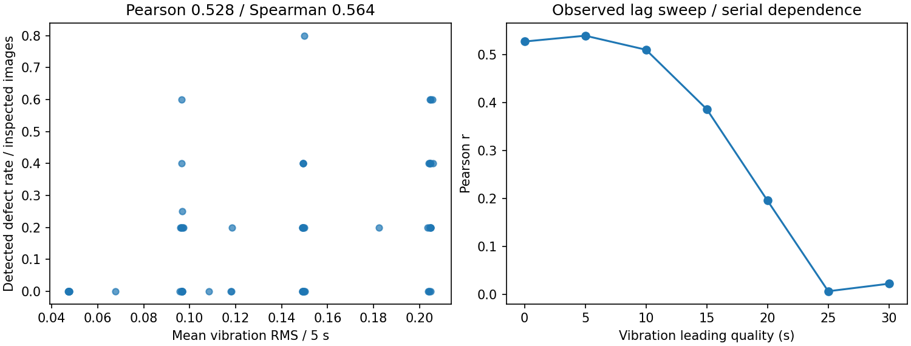
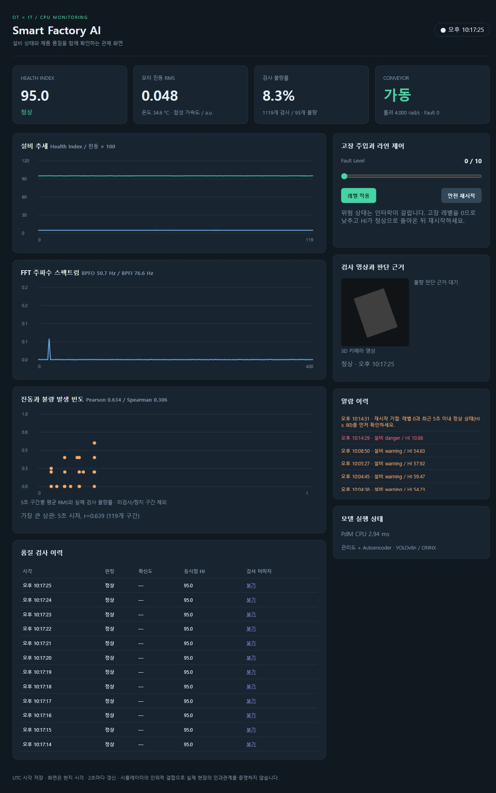
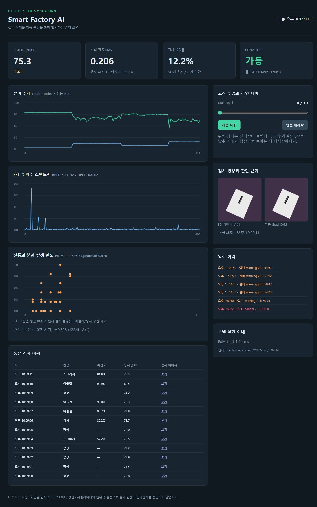
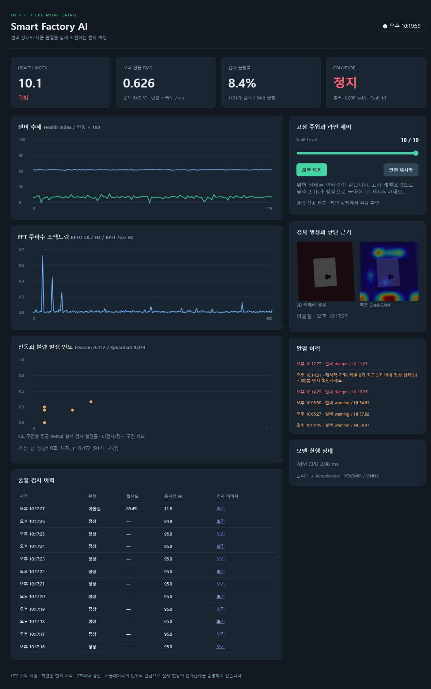
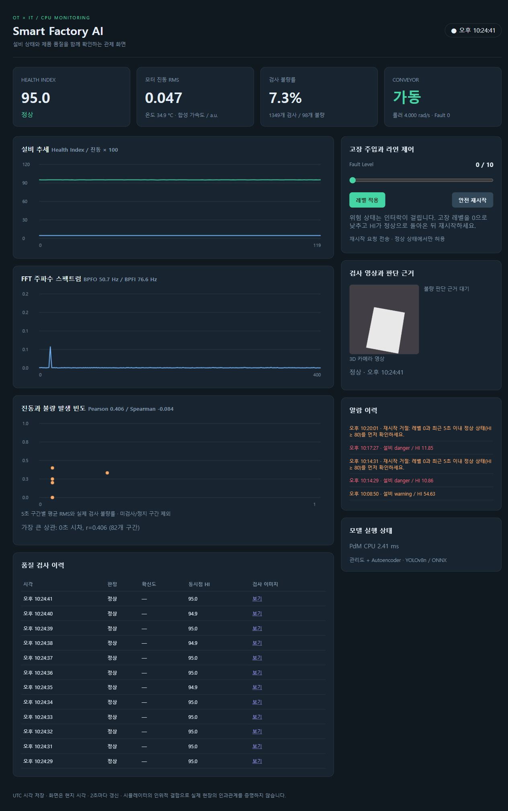

# 통합 관제·저장·라인 안전 제어

## 저장 스키마

`docker/schema.sql`에서 TimescaleDB 확장을 활성화한다.
센서 `sensor_readings`는 timestamp로 분할한 hypertable이며
timestamp, sensor_id, vibration_x/y/z, temperature, fault_level, rpm,
event_id, JSON 관측값을 저장한다. 전체 2,048점 파형은 MQTT로 PdM에
전달하지만 DB에는 특징과 FFT 결과를 `health_readings.data`에 보관한다.

PostgreSQL의 `quality_inspections`에는 id, timestamp, image_path,
defect_type, confidence, bbox, health_index_at_time, gradcam_path,
image_bytes, data가 있다. 복수 결함은 검사 이벤트 한 개 아래 여러 행으로
저장하고 불량률 계산에서는 DISTINCT event_id를 사용한다.
이벤트가 중복 전달되어도 센서 PK·건강/검사 event PK로 중복 기록을 막는다.
경고/위험 전환은 alarms, 최신 Gazebo 관측은 line_status에 저장한다.

## 화면과 제어

FastAPI 읽기 API가 DB를 조회하고 브라우저는 2초마다 snapshot을 갱신한다.
중앙 공정 개요도는 진단 모터 → 컨베이어 → 검사 카메라를 연결한다.
설비를 선택하면 RMS·온도·HI·스펙트럼, 실제 롤러 속도 또는 검사 영상과 이력을
확인할 수 있다. 검사/불량 건수와 최근 알람을 함께 표시한다.
Canvas로 그래프를 그리므로 외부 CDN이나 유료 Vision 서비스가 필요 없다.
관측 시각과 설비별 상태는 `factory/process.py`에서 계산한다.
명령 접수와 실제 적용을 구분하며, 초기 데이터 대기·갱신 지연·연결 오류를 처리한다.
제품의 위치 좌표를 표시하지 않는 공정 개요도이며, 화면과 상세 상태 규칙은
[공정 관제](process-control.md)에 정리한다.

고장 명령은 대시보드 → MQTT → 시뮬레이터로 전달한다.
위험 인터락은 PdM → MQTT health → 독립 controller → MQTT conveyor →
ROS2 scene command → Gazebo physics thread로 전달한다.
controller가 실제 위험 진단을 받으면 `running=false`를 retained로 발행한다.
Gazebo 롤러 관절 속도 목표가 4 rad/s에서 0으로 바뀌며 실측 관절 속도를
line 이벤트로 대시보드에 전달한다.
수동 재시작은 HI와 라인 관측 모두 현재부터 0–5초 이내여야 하며 HI≥80, 적용 고장 레벨 0을 조건으로 한다. 미래·잘못된·시간대 없는 시각은 거절한다. 위험 상태의 reset은
알람으로 거절한다. 복구해도 자동으로 재시작하지 않는다.

## 상관과 시차

센서와 품질을 event_id로 연결한 뒤 5초 구간의 평균 RMS와 불량 검사 비율을
구한다. 실제 검사 2개 이상인 구간만 사용한다. 검사하지 않은 정지 구간은
정상 제품 0개 불량처럼 분모에 넣지 않는다.
표본이 4개 구간 미만이거나 한 값이 상수면 상관계수를 NULL로 표시한다.

Pearson은 선형 관계, Spearman은 순위에 기반한 단조 관계를 측정한다.
0–30초(5초 단위)의 양의 시차에서 `RMS(t)`와 `defect_rate(t+lag)`를
비교한다. 표본 개수를 함께 남기며 가장 큰 값만 인과적 지연이라고 해석하지
않는다. 정지 구간의 빈 버킷은 시간축에 유지하고 값만 NaN으로 처리하여,
5초 shift가 공백을 건너뛴 관측 개수 shift로 바뀌지 않도록 한다.

생성기의 fault_level이 진동과 불량 확률에 공통으로 영향을 주므로 합성 환경의
관련성은 설계상 존재한다. 통제된 여러 레벨 실험으로 이 관계를 확인할 수
있지만 상관계수만으로 실제 공장 설비가 불량의 원인이라고 증명할 수 없다.
환경 요인·공정 부하·제품 종류가 달라지는 실제 데이터에는 교란변수와
공통 원인, 모델 오검출, 시간 누락이 영향을 준다.

## 통합 검증

`python3 scripts/verify_runtime.py`는 UI API에 실제 명령을 보내고 다음을 확인한다.

1. 레벨 0에서 정상 HI와 센서/검사 이력 증가.
2. 레벨 10에서 위험 HI, 인터락, 실제 Gazebo 롤러 속도 절댓값 <0.01.
3. 위험 상태 reset이 거절되는지 확인.
4. 레벨 0 회복 후 수동 reset으로 실제 롤러 속도 >0.5를 확인.

실행 결과는 `docs/results/integration.json`에 저장한다.

## 검증 결과

`results/integration.json`: 정상 검사/센서 건수 증가 → 레벨10 위험 → 실제 롤러
-3.081e-33 rad/s → 위험 reset 거절 → 레벨0 회복과
수동 restart 후 4.000 rad/s를 확인했다.
중간 명령이 장면 업데이트에 덮이지 않도록 Gazebo physics-thread 명령은 FIFO로
처리하며 새 장면에도 현재 desired running을 반복 전송한다.

`results/storage.json`: 센서 3,366행, 검사 961행,
세 가지 불량 88행을 실제 조회했다. 이미지 누락,
5초 이상 경과한 검사 HI 누락과 event HI 불일치는 모두 0건이었다.
실제 JPEG 세 개는 DB BYTEA와 디스크 바이트를 비교하여 SHA-256까지 일치했다.
이 수량은 검증 시점의 스냅샷이며 앱을 실행하는 동안 계속 증가한다.

### 반복 운전의 상관·시차

레벨 [0,2,1,3] / [3,1,2,0] / [0,2,1,3] 순서로 각 30초, 3회 반복했다.
검사된 event_id 387개, 유효 5초 구간 79개다.
Pearson r=0.527927, Spearman rho=0.564187였다.

| 진동이 품질보다 앞서는 시차 | Pearson | 실제 대응 구간 |
|---|---:|---:|
| 0초 | 0.527927 | 79 |
| 5초 | 0.540091 | 78 |
| 10초 | 0.510773 | 77 |
| 15초 | 0.386774 | 76 |
| 20초 | 0.195869 | 75 |
| 25초 | 0.006705 | 74 |
| 30초 | 0.022416 | 73 |

최대 상관은 5초 시차에서 약 0.540이었다. 생성기에는 진동이 제품 불량을
물리적으로 지연시키는 공정을 따로 구현하지 않았으므로 실제 원인 지연이
5초라는 결론을 내릴 수 없다. 5초 집계, 순차적 레벨 유지, 유한 표본의 이항
불량 변동과 serial dependence가 최대값 위치에 영향을 준다.
레벨6을 포함한 사전 운전은 HI 37.08로 인터락이 작동하여 중단하고 정상으로
복구했다. 최종 반복 실험은 인터락이 동작하지 않는 0–3 범위에서 수행했다.
고장 레벨이 같아도 파형·위상·노이즈에 따라 HI와 상태가 달라진다.

다음은 기존 관제 화면에서 수행한 통합 검증이다.
공정 개요도를 추가한 현재 화면과 운전 검증은 [공정 관제](process-control.md)에 기록한다.

대시보드는 검사 이미지와 CAM을 같은 `event_id`로 연결한다. 해당 검사의 CAM이
없으면 이전 검사의 CAM을 표시하지 않는다. 연결 오류 안내는 정상 응답 후
해제되며, 센서 갱신이 5초 이상 지연되면 지연 상태를 표시한다.
