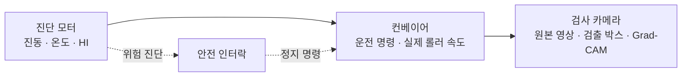
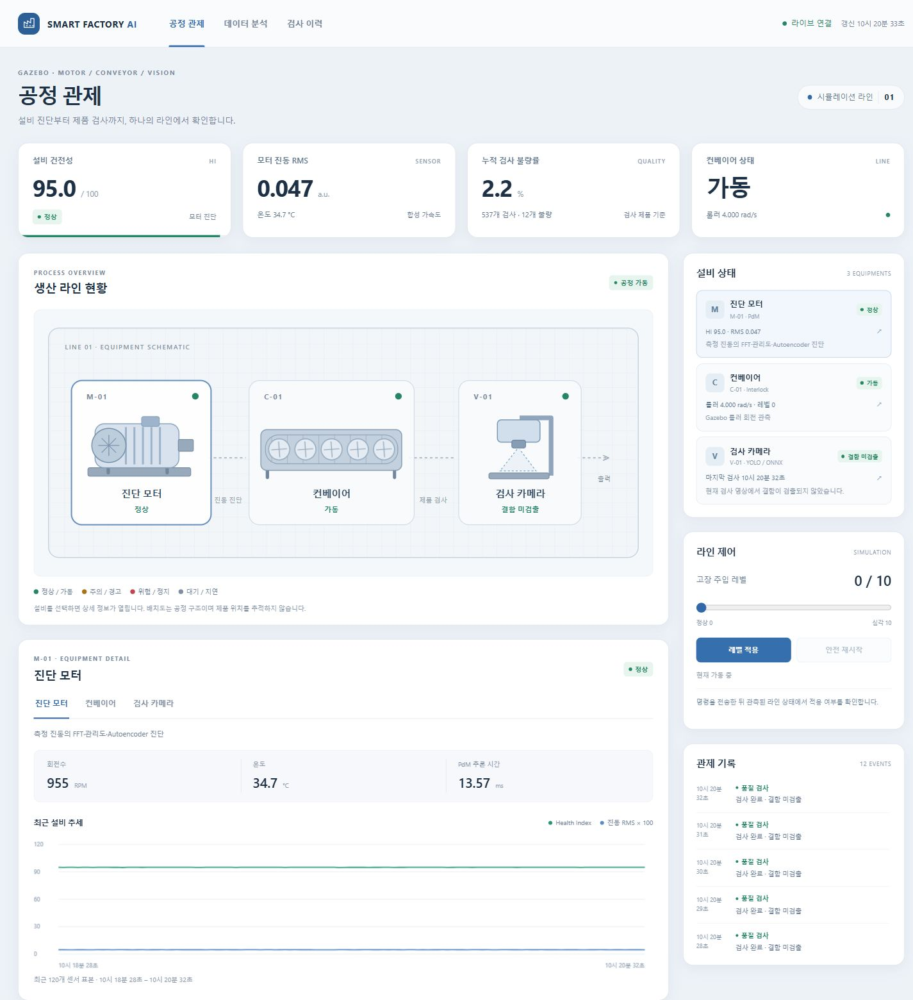
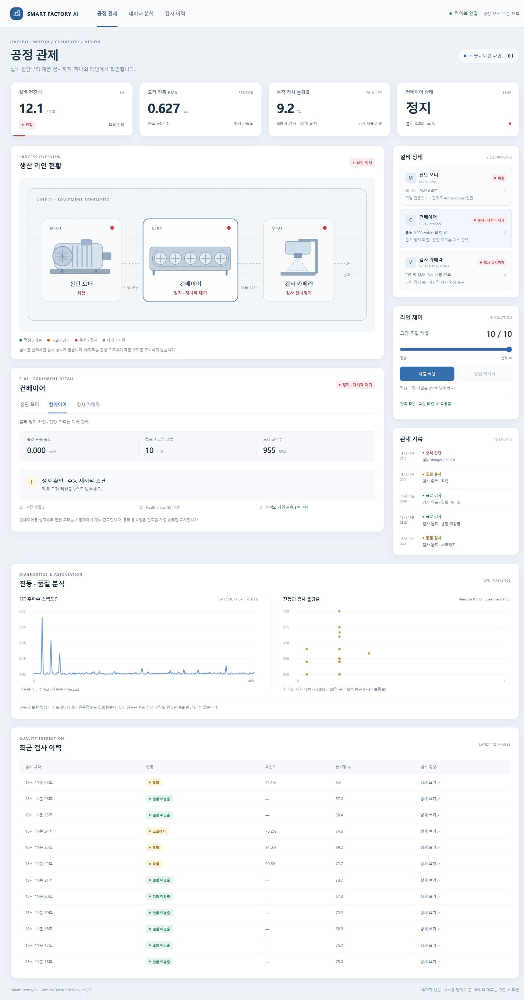
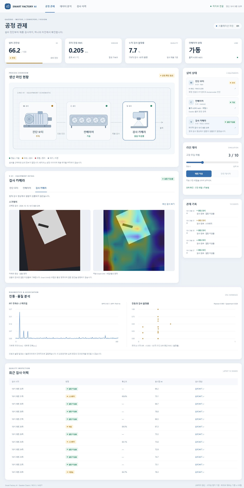

# 공정 관제

모터 진단, 컨베이어 운전, 제품 검사를 하나의 공정 개요도로 연결한다.
설비를 선택하면 해당 관측값과 이력을 확인하고, 고장 레벨 변경과 안전 재시작을 요청할 수 있다.
화면의 상태는 PostgreSQL에 저장된 MQTT 관측으로 계산한다.

## 공정 개요도



개요도는 설비의 관계와 운전 상태를 나타낸다. 제품의 위치·이동 경로·작업자 좌표는
취득하지 않으므로 지도 위에 실시간 위치를 표시하지 않는다. 컨베이어의 운전 표시는
Gazebo 롤러 관절의 실측 속도를 따른다. 도면의 배치는 실제 공장 치수나 설비 배치도가 아니다.

| 설비 | 관측 데이터 | 상세 화면 |
|---|---|---|
| 진단 모터 | PdM 상태, Health Index, 진동 RMS, 온도, RPM | 센서 추세, FFT 스펙트럼, 진단 상태 |
| 컨베이어 | 운전 명령, 실제 롤러 속도, 적용 고장 레벨 | 명령과 관측의 차이, 정지 상태, 재시작 조건 |
| 검사 카메라 | 검사 이벤트, 원본 영상, 검출 클래스·신뢰도·박스 | 검사 이력, 같은 검사 이벤트의 Grad-CAM |

진단 모터는 별도 시험대에서 동작한다. 컨베이어가 인터락으로 정지해도 모터는
회복 상태를 진단하기 위해 회전한다. 모터 회전과 제품 이송 상태는 따로 표시한다.

## 상태와 갱신

브라우저는 2초마다 `/api/snapshot`을 조회한다. `factory/process.py`는
건강 상태, 라인 관측, 검사 결과를 설비별 상태로 묶어 API에 제공한다.
정상·주의·위험·정지 상태는 색상과 문구로 함께 표시한다.

관측 시각은 서버의 현재 시각과 비교한다. 유효한 시간대가 있는 시각이며
현재부터 0–5초 이내인 모터·라인 관측만 현재 상태로 사용한다.
미래 시각, 잘못된 시각, 오래된 값은 최신 관측으로 인정하지 않는다.
데이터가 없거나 갱신이 지연되면 대기·지연 상태를 표시한다.
API 연결에 실패하면 연결 오류를 표시하고, 과거 상태를 현재 정상 상태로 표시하지 않는다.

컨베이어 운전 명령의 `running`과 실제 롤러 속도는 별도 값이다.
정지 요청이 접수되어도 실제 관절 속도가 정지 조건에 도달하기 전까지
물리적인 정지 완료로 표시하지 않는다. 재시작도 같은 방식으로 관측한다.
정지는 `running=false`이며 속도 절댓값이 0.01 rad/s 이하일 때,
가동은 `running=true`이며 속도 절댓값이 0.5 rad/s를 넘을 때 확인한다.
그 사이에는 정지 중·가동 확인 중으로 표시한다.

라인이 정지하면 새 제품 검사 이벤트를 발행하지 않는다. 카메라 상세 화면은
마지막 검사 영상과 촬영 시각을 유지하고 검사 중단 상태를 표시한다.
이때 마지막 영상을 새 검사 결과로 갱신하지 않는다.

## 검사 영상

검출 박스는 해당 검사 영상의 좌표를 기준으로 그린다.
검사 이력을 선택하면 원본 영상, 검출 결과, 시각과 이벤트 ID가 함께 바뀐다.
선택한 과거 검사는 새 결과가 도착해도 유지하며 **최신 검사 보기**로 실시간 검사에 돌아간다.
Grad-CAM은 원본과 같은 `event_id`로 연결한다. 해당 이벤트의 CAM이
계산 중이거나 없으면 대기·없음으로 표시하며 이전 검사의 CAM을 대신 표시하지 않는다.

검출 결과의 `normal`은 모델이 설정 임계값 이상의 결함을 검출하지 않았다는 뜻이다.
실제 제품의 무결함을 확정하는 판정은 아니다. Grad-CAM도 모델의 관심 영역을
보여주는 분석 자료이며 결함 원인의 증명으로 해석하지 않는다.

## 고장 적용과 안전 재시작

고장 레벨은 0–10 범위에서 선택한다. API가 명령을 접수하면 MQTT로 발행하고,
화면은 요청한 레벨과 실제 라인에 적용된 레벨을 구분한다.
명령 접수는 물리 적용 완료를 의미하지 않는다. 적용 여부는 이후 라인 관측으로 확인한다.

안전 재시작은 다음 조건을 만족할 때 요청할 수 있다.

- MQTT 연결이 정상이다.
- 모터 건강 상태와 라인 관측이 모두 현재부터 0–5초 이내다.
- Health Index가 80 이상이고 실제 적용 고장 레벨이 0이다.
- 컨베이어의 물리적인 정지가 확인된다.

대시보드의 사전 확인을 통과해도 독립 controller가 수신 시점의 건강 상태와
라인 관측을 다시 검사한다. 위험 상태의 요청은 거절하며, 정상으로 회복되어도
자동으로 재시작하지 않는다. 수동 요청 후 실제 롤러 속도가 돌아오면 운전으로 표시한다.

명령과 관측은 다음 경로로 이어진다.

```text
대시보드 → MQTT 명령 → controller / simulator → Gazebo 관절
Gazebo 관측 → MQTT → 저장 서비스 → PostgreSQL → 대시보드
```

## 실행

프로젝트 루트에서 실행한다. Docker와 Docker Compose V2가 필요하다.

```bash
docker compose up -d --build
docker compose ps
```

관제 주소는 <http://localhost:8080>이다. 최초 실행에는 이미지 빌드와 모델
초기화 시간이 필요하다. 서비스 로그와 종료 명령은 다음과 같다.

```bash
docker compose logs --tail=30 simulator pdm vision controller dashboard
docker compose down
```

`docker compose down`은 검사 이력과 Docker 데이터 볼륨을 유지한다.
기본 실행에는 기존 v1 모델을 사용한다. v2 생성·후보 모델 실험은
[합성 데이터 편향 검증](bias-validation.md)에 따로 기록한다.

## 화면

정상 운전에서는 모터 진단, 실제 롤러 회전, 최신 제품 검사를 함께 표시한다.
설비를 선택하면 아래 상세 영역이 해당 설비의 관측으로 바뀐다.



위험 진단으로 인터락이 작동하면 컨베이어의 실제 정지와 검사 일시정지를 표시한다.
컨베이어 상세 영역에서 적용 고장 레벨, 롤러 속도와 수동 재시작 조건을 확인한다.



검사 이력의 항목을 선택하면 해당 원본 영상과 검출 박스, 같은 이벤트의
Grad-CAM을 확인할 수 있다. 실시간 설비 상태와 선택한 과거 검사 시각을 구분해 표시한다.



## 검증

공정 상태와 대시보드 API의 회귀 검사 54개가 통과했다.
빈 데이터, 갱신 지연, 미래·잘못된 시각, 누락·비정상 수치, 명령과 실측의 불일치,
안전 재시작 조건, 검사 이벤트 묶음, MQTT 연결·발행 실패와 이미지 경로를 검사한다.
전체 회귀 검사는 133개 통과·2개 skip이며 28.24초가 걸렸다.
skip은 격리된 실행 환경에 원본 학습 데이터가 없어 기존 센서·영상 데이터셋
검사를 수행하지 않은 경우다. [JUnit 원본](results/process-control/tests.xml)에
각 검사 결과를 기록한다. 해당 2개는 원본 v1 데이터를 읽기 전용으로 연결한
별도 실행에서 모두 통과했으며 7.38초가 걸렸다.
[데이터셋 검사 JUnit](results/process-control/dataset-tests.xml)을 함께 보관한다.
이전 편향 검증의 81개 통과 결과는
`results/bias-v2/tests.xml`에 별도로 보관한다.

실제 v1 시뮬레이터·MQTT·DB·분석 서비스를 연결한 운전 검증도 통과했다.
브라우저에서는 고장 적용 확인, 과거 검사·동일 이벤트 CAM 유지, 위험 상태의 재시작 잠금,
수동 복구와 수집 중단 시 관측 지연·제어 잠금을 확인했다.
서버 연결 실패 시에도 마지막 관측임을 표시하고 제어와 롤러 애니메이션을 중지한다.
390px 뷰포트에서도 화면에 가로 넘침이 없음을 확인했다.
[브라우저 관측 기록](results/process-control/browser.json)에 화면별 확인 결과를 보관한다.

| 검증 구간 | 확인한 동작 |
|---|---|
| 정상 운전 | HI 95.0, 롤러 4.000 rad/s, 검사 건수 증가 |
| 레벨 10 위험 | HI 9.92, 롤러 속도 약 0 rad/s, 검사 일시정지 |
| 위험 재시작 요청 | MQTT 요청 접수 후 controller가 거절하고 정지를 유지 |
| 정지 6초 후 | 새 검사 대신 마지막 이벤트의 영상과 촬영 시각 유지 |
| 정상 회복 | 레벨 0·HI 94.9 회복 뒤에도 자동 재시작 없이 정지 유지 |
| 수동 재시작 | 롤러 속도 4.000 rad/s와 검사 건수 증가 |
| 검사 저장 | 최근 12개 이벤트의 중복 제거, 전체 검출 박스 묶음, 실제 JPEG 6,351 bytes 응답 |

운전 관측 원본은 [runtime.json](results/process-control/runtime.json)에 기록한다.
프로젝트 루트에서 실행 중인 서비스를 대상으로 재검증할 수 있다.

```bash
docker compose run --rm --no-deps pdm python3 -m pytest tests/test_process.py tests/test_dashboard.py -q
python3 -m scripts.verify_process
```

`verify_process`는 실제 고장 레벨을 10으로 올려 정지·복구를 검사한다.
정상 종료 시 레벨 0과 수동 재시작 이후의 운전을 확인한다.

## 구현 경계

센서와 영상은 Gazebo 기반 합성 환경에서 취득한다. 공정 화면을 추가해도
기존 모델의 평가 범위가 실제 공장 데이터로 확장되는 것은 아니다.
실제 설비 연결, 제품 위치 추적, 여러 라인의 생산 스케줄링과 산업용 안전 PLC는
현재 구현 범위에 포함하지 않는다.

저장·통신·인터락의 상세 구조와 기존 운전 실험은
[통합 관제·저장·라인 안전 제어](integration.md)에 정리한다.
