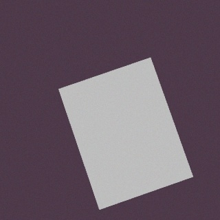
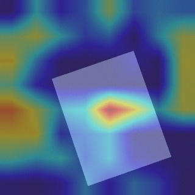
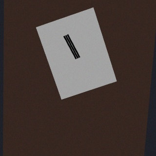
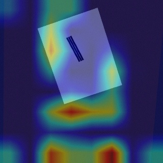
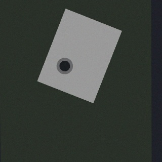
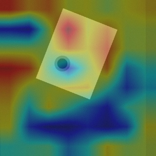
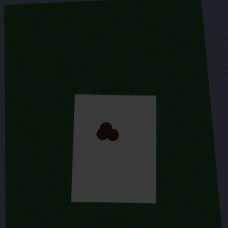
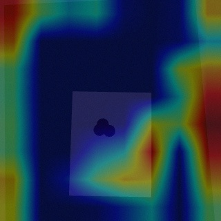
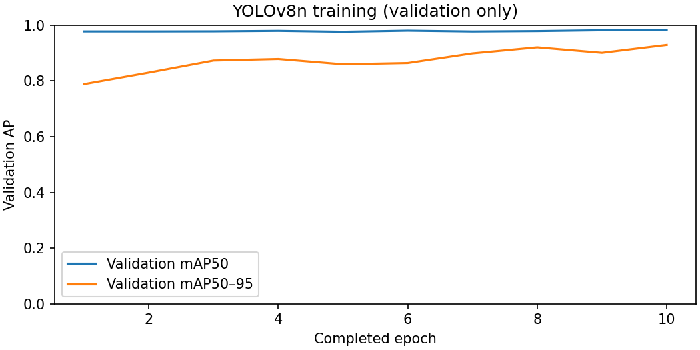

# YOLOv8 품질 검사·Grad-CAM·CPU 배포

## 데이터와 파인튜닝

Gazebo의 실제 카메라로 정상 3,000장과 스크래치/찍힘/이물질 각각 1,000장을
생성한다. 정상 영상은 빈 YOLO label 파일을 사용하고, 결함 영상은 알려진
3D 좌표에서 투영한 bounding box를 저장한다. 70/15/15로 생성 시나리오를
분리하며 테스트 seed 303의 장면은 훈련/검증에 사용하지 않는다.

YOLOv8n COCO 사전학습 가중치로 detector를 초기화한 뒤 Gazebo 영상으로 파인튜닝한다.
입력 256×256, CPU, batch 32, 초기 backbone 10개 모듈 freeze로 설정한다.
학습은 35 epoch LR schedule로 시작했으며 CPU 예산에 따라 10 epoch에서 종료했다.
저장된 체크포인트를 validation fitness로 선택한 뒤 별도 test 세트로 평가했다. 현재 재현 기본값은 10 epoch이며
원래 35 epoch LR schedule과 정확히 동일한 가중치를 보장하지 않는다.
학습 원본과 선택 과정은 `results/training.json` 및 `results/vision-training.csv`에 남긴다. freeze는 사전학습 특징을
재사용해 CPU 학습량을 줄이며 neck/head가 새 결함 클래스에 맞게 갱신된다.
훈련의 best.pt는 **validation fitness(0.1×mAP50 + 0.9×mAP50–95)**로 선택했다. 선택된 완료 epoch는 10이다. test mAP로 체크포인트를
고르지 않는다. Ultralytics의 훈련 증강은 제한된 회전·위치·밝기 변화와 낮은
mosaic 확률을 사용한다. 생성 단계의 실제 조명/카메라 랜덤화와 구분된다.

외부 이미지 데이터셋을 이 프로젝트 파인튜닝 입력으로 사용하지 않는다.
COCO 가중치는 전이학습 초기화에만 사용한다.

## 검출과 저장

학습 checkpoint를 ONNX opset 17 / FP32 고정 입력으로 export한다.
ONNX Runtime CPU는 4개 내부 thread / 1개 inter-op thread를 사용한다.
전처리: BGR→RGB, resize, CHW, float32/255.
YOLOv8은 별도 objectness 곱 없이 class score를 사용한다.
conf ≥0.25와 클래스별 NMS IoU 0.45를 적용하고 원본 영상 좌표로 복원한다.

불량 종류·확신도·bbox·원본 영상 경로를 MQTT로 발행한다.
저장 서비스는 PostgreSQL 품질 테이블에 원본 JPEG **BYTEA와 경로**, 결과,
동일 event_id의 HI를 저장한다. 정상 검사도 이력에 남겨 불량률 분모를 얻는다.
정상 행의 confidence 1.0은 모델의 정상 확률이 아니라 저장용 표시값이다.
UI에서는 정상 확신도를 표시하지 않는다.

## Grad-CAM 계산

target layer는 YOLOv8 backbone의 마지막 SPPF Conv2d인
**`model.9.cv2` Conv block의 BN/SiLU 이후 출력**이다. 내부 마지막 Conv2d는
`model.9.cv2.conv`이며 raw Conv 출력과 block 출력의 실제 비교는
[검증 보고서](validation.md)에 있다.
검출에 해당하는 클래스의 가장 높은 **NMS 이전 score**로 역전파한다.
공간 평균 gradient를 activation 채널별 가중치로 적용하고 ReLU를 거쳐
정규화·업샘플링한다. 최종 영상에 heatmap을 overlay해 저장한다.

정상 영상에는 normal 클래스가 없으므로 가장 큰 결함 score의 CAM을 구한다.
즉, 정상 CAM이 '정상 판정의 확률적 증거'라고 해석되지 않는다.
불량 영상과 비교하여 결함 부위에 얼마나 집중하는지, 제품 경계/배경에
집중하는 shortcut이 있는지 관찰한다. target_score도 함께 남긴다.
양수 activation이 없으면 원본 영상을 유지하고 `informative=false`를 기록한다.

런타임에서는 detector 결과를 먼저 발행하고 별도 한 개 worker에서 CAM을
계산한다. CAM은 PyTorch 역전파가 필요하므로 ONNX 검출 FPS 측정에
포함하지 않는다. detector 처리 속도와 CAM 생성 지연은 별도 측정 대상이다.

## 평가 결과

측정 결과는 `docs/results/vision.json`에, 원본 영상과 Grad-CAM은 `docs/results/`에 있다.

| 항목 | 실측 |
|---|---|
| 독립 테스트 mAP@0.5 | 0.969052 |
| scratch / dent / contamination AP50 | 0.966465 / 0.945825 / 0.994867 |
| ONNX, 전처리+NMS 포함 100장 평균 FPS | 66.261 |
| PyTorch, 같은 100장 평균 FPS | 25.446 |
| 입력·반복 | 256×256 / batch 1 / 10장 warmup + 100장 |

평가 대상 100장은 test에서 seed 42로 비복원 추출한다. 영상은 먼저 디코딩해
메모리에 둔다. 측정 구간에는 resize·색 변환·정규화·추론·NMS를 포함하고,
JPEG 파일 IO/네트워크/DB/CAM은 포함하지 않는다. 평균, p95, 장별 원본
지연과 하드웨어를 기록한다. 목표는 mAP50 ≥0.80과 평균 ≥20 FPS다.
ONNX와 PyTorch의 동일 이미지 benchmark 비교를 경량화 선택 과제로 제공한다.
INT8 양자화와 pruning은 적용하지 않았다.

현재 데이터는 단순 형상과 한 가지 제품 계열이므로 높은 합성 테스트 정확도가
현실의 미세 균열·금속 반사·가려짐·새 제품 재질의 성능을 보장하지 않는다.
실물 데이터로 검증하고 결함 geometry/텍스처를 다양화해야 Sim-to-Real 격차를
정량화할 수 있다.

참고: [YOLOv8](https://docs.ultralytics.com/models/yolov8/),
[ONNX export](https://docs.ultralytics.com/modes/export/),
[Grad-CAM 논문](https://arxiv.org/abs/1610.02391).

## Grad-CAM 비교

| 이미지 | 역전파 target score | gradient 절댓값 합 | 양수 활성 존재 |
|---|---:|---:|---|
| normal | 0.000173 | 0.009735 | True |
| scratch | 0.822123 | 3.158808 | True |
| dent | 0.871194 | 0.908830 | True |
| contamination | 0.873829 | 0.870964 | True |

각 heatmap은 실제 gradient에서 생성했으며 정상 영상의 매우 낮은 결함 score와
불량 영상의 높은 score를 구분한다. 색은 이미지마다 정규화하므로 정상의 밝은
색을 높은 불량 확신도로 읽으면 안 된다. SPPF 8×8의 낮은 공간 해상도와
배경·제품 테두리의 활성 때문에 정확한 결함 분할 마스크로 사용할 수 없다.

 
 
 
 

영상별 관찰과 해석:

| 영상 | 관찰 | 해석 |
|---|---|---|
| 정상 | 결함 target score 0.000173, 정규화된 색이 존재 | 낮은 score에서의 상대 activation이며 정상 확률이나 불량 확신도가 아님 |
| 스크래치 | 제품 왼쪽 모서리·하단 배경의 활성도 강함 | 검출 박스가 맞아도 마지막 backbone CAM이 홈 위치만 강조하지 않음 |
| 찍힘 | 원형 결함뿐 아니라 제품 위쪽·주변 배경에도 활성 | 제품 경계와 문맥 특징의 영향, 정확한 픽셀 근거로 해석하지 않음 |
| 이물질 | 오염 덩어리보다 제품 오른쪽 배경 활성도 강함 | 단순 합성 장면의 문맥 의존 가능성; 실물 배경 교체 검증 필요 |

CAM은 제품 경계와 배경에도 반응하며, 높은 검출 mAP가 정확한 위치 설명을
보장하지는 않는다. 배경·재질을 다양화한 실물 검증과 위치 기반 설명 평가가 필요하다.
